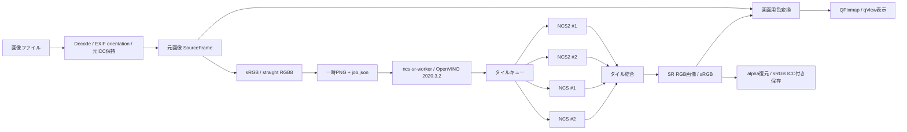

# qViewSR 設計書

状態: **GUI機能検証用の試作版を実装・ビルド済み**。2026-09-22。実機4本からGUI表示・保存まで確認。下記は目標設計を含み、全項目の完了を意味しない。

### 追加要望への対応（2026-09-22）

- 長文の状態表示は改行を空白に変換して1行・固定高さ。フルスクリーンでSRバーを非表示。ショートカットはメインウィンドウに残す。
- Qt標準の日本語とqView翻訳を実行ファイルへ埋め込み、未訳の設定項目を補完。初回更新時は日本語へ移行し、その後の明示的な言語選択は保持。
- decoderのQImageを共通入力とし、形式のJPEG/PNG限定を撤廃。WebPの元ICCも抽出。アニメーションは現在のフレームを静止してSR、再開時に結果を破棄。CMYKは既にRGB化されたdecoder出力をsRGBと仮定する旨を表示。
- `--serve` workerはstdinのconfigure/run/cancel/shutdownを受け、SessionがCore・ExecutableNetwork・InferRequest・USB所有lockを保持。起動時に準備し、同じbackendなら再利用。画像ごとにタイル統計・PNGを新規生成。モデルhashとshapeの検査はSession初期化時、画像hash・寸法検査は各jobで実施する。
- 入力読取スレッドがcancelを受け、推論スレッドは現在のタイル後に終了する。中止の正常応答ではpoolを保持。15秒応答なし／120秒進捗なし／全個体失敗ではworkerを破棄し、次回に初期化する。古いjob IDの通知は現在の表示に反映しない。
- `denoise`（0..15、既定0）はjob設定。sRGBのLR画像全体にOpenCVの色付きNon-local Means（template 7/search 21、hとhColorは設定値）をかけてからタイル化する。halo境界で独立にフィルターをかけない。alphaはGUI側で別に保持する。
- ウィンドウ間のpool共有は未実装。所有lockはウィンドウを閉じるまで保持するため、SRを利用するウィンドウは1つとする。古い設計段階の対象限定は本項で置き換える。
- pushによるGitHub CIはユーザー指定で実行しない。コミットに`[skip ci]`を入れ、検証はローカルで行う。

### 現在の実装

- `src/sr/sr_controller.*`: ツールバー、設定、非同期準備・worker起動、世代管理、中止、検証済み結果の表示、PNG/JPEG保存。Qt 6/C++17。
- `src/sr/color_pipeline.*`: JPEG APP2/PNG iCCPのICC抽出、LittleCMS2による入力・表示色変換。元画像は`QVImageCore::ReadData`で表示画像から分離。
- `worker/main.cpp`と`tile_plan.h`: 固定1032モデル、ハロー付きタイル、デバイス別requestと動的配分、正常完了時のみ出力公開。C++14・独立プロセス。
- `tests/tst_srtests.cpp`: GUIボタン、色変換、alpha、切替と倍率、表示ICC変更、回転保存、キャンセル、終了、worker失敗、hash不一致の試験。実機試験は明示実行。
- 実装上は役割を上記クラスに集約。後述の個別サービス名は将来の分割案。SR結果は現在画像のメモリー内に1つだけ保持し、再利用キャッシュは未実装。source keyは正立・sRGB化した入力PNGと元ICCのhash。読込前後のsize/mtime変更とキャッシュ登録前のrevisionを確認するが、ファイル全体hashによるrevision管理は後続。
- 表示ICC手動指定はウィンドウ設定1個。モニターごとの保存や自動割当は未実装。通常はLittleCMS表示変換、手動ICC、またはX11 root ICC取得失敗時のsRGBを使う。

起動・操作・既知の制限は[README-SR.ja.md](../../README-SR.ja.md)、測定済みの結果は[HARDWARE.ja.md](HARDWARE.ja.md)を参照。

## 1. 目的と引き継ぎ

UbuntuでJPEG/PNGを連続閲覧し、必要な画像だけNCS×2＋NCS2×2で超解像して表示・保存する。qViewの軽い操作感、左右キーでの画像送り、ホイールでの拡大縮小を維持する。

参考会話「NCS2活用方法比較」から、qViewを基盤にすること、旧OpenVINOのバージョン固定、Dockerを使わないこと、独立した推論プロセス、動的なタイル配分を引き継いだ。会話中の互換性や性能の推測は、確認済みの事実とは区別する。

| 要件 | 初期実用版での仕様 | 検証 |
|---|---|---|
| JPEG/PNGの連続閲覧 | qViewのフォルダー列挙・先読み・左右/Home/Endを利用 | 画像送り中にSRが完了しても別画像を表示しない |
| ホイール拡大縮小 | 既存ズームを維持。SR切替時は同じ構図を保つ | ウィンドウ中心・カーソル位置・HiDPI |
| 色管理 | 元画像ICC、SR用sRGB、画面ICCを分離 | Adobe RGB/P3/sRGB/ICCなし/破損ICC |
| 複数NCS | 稼働確認済みの個体だけを動的キューに参加させる | 1本、NCS2×2、全4本を比較 |
| SR表示 | 明示操作で×4。元画像を表示したまま実行し、完成後切替 | キャンセル、画像切替、worker異常 |
| SR保存 | PNG/JPEG、sRGB ICC付き、別名保存 | 再読込、寸法、ICC、画面ICCの混入なし |
| ホスト環境 | Ubuntu 24.04、コンテナなし。旧runtimeは専用ディレクトリー | QtとOpenVINOの依存を別プロセスに隔離 |

初期実用版の対象はSDRのRGB/グレースケールJPEGとPNG。透明PNGはalphaを分離して保持する。CMYK/YCCK JPEG、HDR、16-bit精度でのSR、動画/アニメーションSR、学習、バッチ書き出しは後続。対象外画像もqViewの通常閲覧は可能だが、正しい色の入力を保証できない形式ではSRを無効にする。16-bit PNGは原画像を保持し、SR時の8-bit化を表示する。

## 2. 確認済みの前提と未確定事項

- qViewの基点は`c5eca1c7176549e0f0718d11201547ddcdb1f8c9`（main、2026-04-04）。リリース7.1とCMake内の7.0表記を混同せず、コミットを基準にする。
- 初代NCSを残す共通runtimeはOpenVINO **2020.3.2**。公式アーカイブは`2020.3.355`、実際のIE build文字列は`2020.3.2-3506-c35b42b1d89-releases/2020/3`。公開ソースタグは`2020.3.2`。バイナリーと公開タグが同一ビルドであるとは仮定しない。
- Intelは初代NCSの対応を2020.3までとしている。[Intelの対応版案内](https://www.intel.com/content/www/us/en/support/articles/000091265/software.html)。別runtimeへの拡張は可能だが、初期版で2022/2023以降のAPIを混在させない。
- 2020.3のOpen Model Zooに1032 FP16が実在する。XML/BINの取得と当時のSHA-256照合が成功した。取得したIRはversion 10。
- ホストで旧runtimeをロードでき、1032のCPU定数画像推論が成功。これはNCSの演算成功や写真の品質を保証しない。
- MYRIADから4個体のID取得が成功。初回のUSB書込権限不足を修正した後、**初代NCS×2・NCS2×2すべてで1032の単独定数画像推論に成功**。2450/2480両方のoffline compileも成功した。写真を含む897×477入力の4本並列・4倍出力・GUI表示保存まで確認。世代間の画質差と連続負荷は評価中。
- Qt 6.4.2、CMake 3.28.3、LittleCMS2 2.14で本体とテストをビルド。offscreenとX11の実機GUI試験が成功。

実測と未確認項目は[実機検証記録](HARDWARE.ja.md)に分離する。特に「4本が見える」「firmwareが起動する」「1032がコンパイルできる」「期待した出力になる」「並列化で速くなる」はそれぞれ別の合格条件とする。

## 3. 全体構成



GUIはQt Widgets/C++17にSR moduleを追加する。初期ビルド基準はUbuntu 24.04のQt 6.4以上で、CMakeはQt 6を必須とする。色変換はLittleCMS2を使用する。JPEGのAPP2分割とPNGのiCCPを上限付きで直接読み、PNG CRCとzlib展開を検証する。画素decodeと保存はQtのJPEG/PNG pluginを利用する。

workerはQtをリンクせず、OpenVINO C++ InferenceEngine APIと旧runtimeに対応したOpenCVを使う。runtimeの`LD_LIBRARY_PATH`はworker起動時のみ設定する。GUI側へ古いTBB/OpenCVを流入させない。ホスト`/usr/lib`の差替えやグローバルな`setupvars.sh`の読み込みは行わない。

CPUは比較・明示選択用バックエンドとして設ける。NCS失敗時にCPU処理をNCS成功として表示しない。将来の別runtimeは同じworker契約の別実装として追加できる。

## 4. 参照ソースと改造箇所

以下の行番号は上記qView基点に対する調査時の位置。実装時は関数名でも確認する。

| ソース | 現在の責務 | 変更・参照内容 |
|---|---|---|
| `src/qvimagecore.h:74` `ReadData` | 表示色変換済みQImageを保持 | source画像・元ICC・orientation適用後の寸法・source revisionを保持する構造へ分離 |
| `src/qvimagecore.cpp:112` `readFile` | Decode、ARGB32 premultiply、ICC変換 | 表示色変換の前で不変のsourceを保持。ICC抽出をpremultiply/色変換前に実施 |
| 同 `loadPixmap` | 回転後のQPixmap作成、file details更新 | GUI threadでのみPixmap作成。表示バリアント切替をファイル読込から分離 |
| 同 `requestCachingFile` / `addToCache` / `getPixmapCacheKey` | 元画像先読み、パス＋サイズ＋画面ICCのキー | source、SR結果、表示派生のキャッシュを分離。mtimeと内容hashも扱う |
| 同 `getTargetColorSpace` / `detectDisplayColorSpace` | 表示先ICC決定 | `DisplayProfileProvider`へ移動。画面ICCをworkerへ送らない |
| `src/qvlinuxx11functions.cpp:24` `getIccProfileForWindow` | X11 rootの`_ICC_PROFILE`取得 | 現状はwindow引数未使用。複数画面の自動認識を保証しない。手動ICC選択を追加 |
| `src/qvgraphicsview.cpp:509` `updateLoadedPixmapItem` | Pixmap更新とscene更新 | 元画像/SR切替で同じsource座標と表示倍率を維持 |
| 同 `scaleExpensively` / `makeUnscaled` | 縮小描画・元Pixmapへの復帰 | 選択中の表示バリアントを使う。ズームで元画像へ戻らないよう統合 |
| 同 `goToFile` / `wheelEvent` | 画像送り・ズーム | 操作体系を維持。画像送り開始時にSR要求のgenerationを無効化 |
| `src/actionmanager.cpp` `initializeActionLibrary` / `actionTriggered` / `buildToolsMenu` | メニューとaction dispatch | `srstart`、`srcancel`、`srtoggle`、`srsaveas`、`srdevices`を追加 |
| `src/mainwindow.cpp` `disableActions` / `saveFrameAs` | UI enable、既存フレーム保存 | SR状態に合わせたenable。SR保存は独立した`SrExportService`へ |
| `src/settingsmanager.*` / `qvoptionsdialog.*` / `shortcutmanager.*` | 設定・ショートカット | workerパス、モデル、使用デバイス、画面ICC、メモリー上限、SRキー割当 |
| `CMakeLists.txt` / `tests/CMakeLists.txt` | ビルド | `QV_ENABLE_SR`、Qt Concurrent明示リンク、LCMS2/JPEG/PNG、SR testsを追加。workerは独立ビルド |

再利用する外部ソース:

| リポジトリ・固定点 | ファイル | 参照する内容 |
|---|---|---|
| [Open Model Zoo 2020.3](https://github.com/prokyon486/qViewSR-open-model-zoo/tree/912eeaddc034e31dedd34617d82bcc2ddf83e542) | `demos/super_resolution_demo/main.cpp` | `Core::ReadNetwork`、入力"0"/"1"、bicubic補助入力、出力×255 |
| 同上 | `demos/common/samples/ocv_common.hpp` `matU8ToBlob` | BGR HWC→NCHW変換。0～255のまま投入する点 |
| 同上 | `models/intel/single-image-super-resolution-1032/model.yml` / `description/*.md` | アーティファクトURL、SHA-256、入出力shape、倍率 |
| [OpenVINO 2020.3.2](https://github.com/prokyon486/qViewSR-openvino/tree/0b3773b7405d955d48642667ac5113289b9baab2) | `inference-engine/src/vpu/myriad_plugin/myriad_plugin.cpp` `Engine::GetMetric` | `AVAILABLE_DEVICES`、`FULL_DEVICE_NAME`、明示`DEVICE_ID` |
| 同上 | `myriad_config.cpp` / `myriad_metrics.cpp` / `myriad_executor.cpp` | 実際に受理される設定、名前、デバイスpoolとboot処理 |
| 同上 | `inference-engine/include/vpu/myriad_plugin_config.hpp` | `VPU_MYRIAD_PLATFORM`の2450/2480。個体IDとの違い |
| [ImageViewer固定ソース](https://github.com/AlienCowEatCake/ImageViewer/blob/8ee711c5b4bfeb133c675da7dc4c262dc5b29787/src/ImageViewer/src/Decoders/Impl/Internal/Utils/CmsUtils.cpp) | `ICCProfile::Impl::getOrCreateTransform` / `ICCProfile` | LittleCMSのprofile/transform寿命管理とQt fallback。現段階では参照のみ |

参照会話にあった現行`image_processing_demo`の`ov::` APIを2020.3 workerへコピーしない。旧版demoの入力画像数をbatchに設定する処理も持ち込まない。VPU用batchは1に固定する。

qView、OpenVINO、OMZのフォークは作成済み。ローカルの`references/`は調査用で、qViewリポジトリへ巨大なソースをコピーしない。OpenVINO自体は原則無改変。外部コードを転用する場合は元の著作権/SPDXを維持し、`THIRD_PARTY_NOTICES`に元コミットを記録する。モデル・firmware・runtimeの再配布条件はソースのLICENSEと分けて確認し、試作では公式URLから取得する。

## 5. データモデルと色管理

### データの所有

`SourceFrame`はファイルrevision、EXIF orientation適用後の画像、元ICC bytes、ICC状態（valid/missing/invalid/unsupported）、精度、alphaを保持する。不変データとし、画面用変換で書き換えない。ファイル読込時のEXIF回転とユーザーが選んだ表示回転は別に管理する。

`SrInput`は非線形sRGBのstraight RGB8。`SrResult`は同じsRGBのRGB8、source key、model hash、処理パラメーター、実際に使ったデバイス、完了時刻を持つ。GUIの`QPixmap`は表示用コピーに限る。

### 処理順序

1. JPEG/PNGから元ICCを取得し、DecodeとEXIF orientationを一度だけ適用する。
2. 元画像表示はsource ICC→画面ICC。SR入力はsource ICC→sRGB。初期のSR変換intentはrelative colorimetric＋black point compensationに固定して記録する。
3. ICCなしはsRGBと仮定して表示に明記する。壊れたICCと未対応ICCを「ICCなし」に丸めない。元画像閲覧を継続し、SRは明示的なsRGB仮定の選択があるまで無効。
4. premultiplied画像はunpremultiply後にRGB処理。alphaは推論しない。完全透明領域のRGBは0に正規化し、alphaを別経路で同倍率に補間する。半透明端の色にじみを試験し、許容できないケースでは透明PNGのSRを制限する。
5. BGRへの並び替えはworkerとの境界で一度だけ。linear sRGBや画面RGBをモデル入力にしない。
6. worker結果はsRGBとして検証・保持。画面へ出す直前に画面ICCへ変換する。

Qt 6.4のQColorSpaceだけに全ICCを任せない。RGB matrix/TRC、RGB LUT、グレースケールprofileをLittleCMS2で扱い、失敗を返す。CMYKのままのサンプルとCMYK profileが必要な画像は初期SR対象外。QtでRGB化したCMYK画像へ元CMYK ICCを後付けして変換しない。[Qtの色空間型と導入版](https://doc.qt.io/qt-6/qcolorspace.html)を互換性確認に使う。

### 画面ICC

初回ホストはX11。初期版は「自動（既存X11 root ICC）」「手動ICC」「sRGB」を用意し、実際のprofile名と由来を表示する。自動取得できない場合はsRGB仮定であることを明示する。複数モニターでは画面識別子ごとに手動profileを設定できるようにし、`QWindow::screenChanged`で表示キャッシュだけを更新する。

Waylandは初期の画面ICC保証対象外。compositorの色変換とアプリ側の二重変換を検証するまで、X11での色管理を先に成立させる。SR入力と保存のICCはセッション種別に依存しない。

## 6. 1032のモデル契約

| 項目 | 固定仕様 |
|---|---|
| モデル | `single-image-super-resolution-1032`、OMZ 2020.3、FP16 weights、IR v10 |
| 倍率 | ×4（×2指定や任意倍率のAIモデルとして扱わない） |
| LR入力 | 名前`0`、NCHW `[1,3,270,480]`、BGR、値域0～255 |
| 補助入力 | 名前`1`、NCHW `[1,3,1080,1920]`、同LRタイルをOpenCV `INTER_CUBIC`で拡大 |
| API blob | 初期実装はFP32を明示し、runtimeがVPU用へ変換。FP16 weightsとblob precisionを区別 |
| 出力 | 単一出力、`[1,3,1080,1920]`、BGR、原則0～1。有限性を確認して×255、clamp、丸め |
| 制約 | バッチ1、shape固定。異なるモデルhashやshapeは早期エラー |

OMZの現行モデルを同名だからと差し替えない。最新版から2020.3で読めないIRを持ち込む事故を防ぐため、URLとhashを[source-lock.json](source-lock.json)で固定する。小型タイル用のreshapeは初代NCSを含む実機で成功を確認してから別モデルrevisionとして追加する。

## 7. タイル処理

初期候補はLR halo `h=16`、固定入力480×270、採用領域448×238。halo=16は確定した品質保証値ではなく、8/16/24/32の比較で決めるパラメーター。取得したグラフにはConvolution/Reshape等があり、global poolingは見つからなかったが、それだけで境界の一致を保証しない。

source上の採用領域の左上を`(x,y)=(i*448,j*238)`とし、入力窓は`[x-h,x+448+h) × [y-h,y+238+h)`。画像外はreflect101で埋め、幅/高さ1ではreplicateへ切り替える。最終タイルも必ず480×270を作る。

推論出力の左上`(4h,4h)`から、幅`4*min(448,W-x)`、高さ`4*min(238,H-y)`を採用し、結果の`(4x,4y)`へ書く。各出力pixelは一度だけ書き込まれ、完成寸法は正確に`4W × 4H`。初期はhalo crop方式に固定し、曖昧な重ね合わせや未定義のblendは使わない。

bicubicの補助入力はhaloを含む同じ入力窓から生成する。大画像全体の高解像度FP32補助画像を生成しない。最初の検証では480×270以内の画像についてタイル経路と単一推論を比較し、外周・内部境界・chroma・画素位相を別々に確認する。平坦色、斜線、細線、文字、ノイズを含む写真が必要。

CPUとMYRIADの数値差はhaloで解消しない。混在デバイスの出力を同一タイルで比較し、継ぎ目が残る場合はCPU混在を禁止し、NCS1/NCS2も同一世代poolへの制限を検討する。均一色で境界が見える状態を完成扱いしない。

## 8. デバイス制御とスケジューラー

`Core::GetMetric("MYRIAD", METRIC_KEY(AVAILABLE_DEVICES))`でセッション内IDを列挙し、各IDについて`LoadNetwork(network,"MYRIAD",{{CONFIG_KEY(DEVICE_ID),id}})`を呼ぶ。`MYRIAD.0`などの固定連番を仮定しない。`VPU_MYRIAD_PLATFORM=2450/2480`は世代の選択であり、個体選択の代替ではない。

各個体に1個のExecutableNetworkと1個のInferRequestを持ち、1個体1タイルから始める。モデル読込は順番に行い、成功した個体をreadyにする。専用スレッドが共有キューから次のタイルを取得する。複数スレッドで同じrequest/bufferを使わない。初期実装では4つの専用スレッド内の同期`Infer()`で十分に並列化できる。

タイル状態はpending→running(device,attempt)→done。通常の推論例外では該当個体をquarantinedにし、そのタイルを一度だけ別のready個体へ返す。二重完了をIDで排除する。未完了タイルがあれば完成画像を公開しない。

bootやInfer自体のhangは同じworkerプロセス内の他個体にも影響する。初期版はGUI側watchdogでworker全体を終了し、部分結果を破棄して元画像を維持する。復帰は明示的な再試行。故障個体だけの強制停止は後続の「個体ごとの子プロセス」化で扱う。

4本を均等に4分割しない。まずpull queueで計測し、後に個体別移動平均を用いて短い残タイルを速い個体へ残す。画像にタイルが少ない場合はNCS1参加が完了時刻を遅くする可能性がある。NCS2×2と全4本を比較して自動選択を決め、4本参加を速度向上の保証にしない。

USB port pathとruntime ID、boot前後PIDを診断表示する。IDは再接続後も不変のserialではないため、再列挙する。異なるアプリ/workerが同じNCSを同時に所有しないよう、ユーザーruntime directory内で所有lockを取る。

## 9. GUIとworkerの契約

`QProcess`から`ncs-sr-worker --serve`を起動して保持する。stdinは64KiB上限のJSON Lines。初回configureにはsession用job_id、model_xml、devices、lock_fileを渡す。`session_ready`後にrunを送る。各jobは一意な`QTemporaryDir`（ユーザー専用）にsRGB RGB input.pngを配置する。共有の固定名は使わない。モデル/デバイスの設定が変わるとshutdownし、正常終了を最大10秒待ってから、USB再列挙の猶予1秒をおいて新workerを起動する。この待機は非同期でGUIを止めない。

```json
{
  "protocol_version": 1,
  "command": "run",
  "job_id": "uuid",
  "source_key": "sha256",
  "input": "/private/job/input.png",
  "output": "/private/job/output.png",
  "model_xml": "/configured/single-image-super-resolution-1032.xml",
  "input_sha256": "sha256 of input.png",
  "width": 897,
  "height": 477,
  "halo": 16,
  "devices": "all",
  "denoise": 6,
  "max_memory_bytes": 2147483648
}
```

診断用には`ncs-sr-worker --job /private/job/job.json`も残す（この場合はjobにlock_fileを含める）。stdoutはversion付きJSON Linesの`session_ready/started/device_ready/progress/completed/cancelled/error`、stderrはログ。**調査用ncs-probeのstdoutは旧ライブラリーの診断行が混ざる可能性があり、製品IPCとして流用しない。** 製品workerではライブラリstdoutをstderrへ隔離するか、制御用専用pipeへ切り替える。

completedはjob_id、source_key、出力寸法、色空間sRGB、出力hash、使用デバイス、timingを含む。結果は一時名に書き、close後に同じjob directory内でrenameして公開する。GUIはcompleted、job ID、ファイル存在、寸法、hash、色空間、ノイズ低減設定を確認する。常駐workerの正常exitは成功通知として使わない。

入力サイズ・出力サイズ・倍率・halo・path・モデルhashを起動前に検証。stdout行は64KiB以下、GUIが保持するstderrは末尾64KiBに制限。現在の起動・タイル進捗停止timeoutはいずれも120秒。USB bootが長い場合は測定値に基づき調整する。

GUI状態: `Idle → Preparing → Starting → Running → Ready`、任意の途中状態から`Cancelling → Idle`、失敗は`Error`。画像送りでgenerationを増やし、旧jobをcancelする。cancel後の遅延signalや完成通知はjob_id/generation不一致で捨てる。通常はcancelコマンドを送り、タイル終了後のcancelled/completedを受けて一時ファイルを除去する。15秒応答がなければworkerを終了し、次回に初期化する。

初期は原画像先読みのみ継続し、隣画像のSR先読みはしない。全タイル完了前の部分画像表示も後続。モデルloadは常駐化で再利用する。PNG往復が支配的なら、契約を保ってUnix socket/共有メモリーを検討する。

## 10. キャッシュ、ズーム、保存

キャッシュは3層に分ける。

- source key: canonical path、file size、mtime（利用可能な最高精度）、明示reload世代。SR要求時に原ファイルhashを計算し、読込前後stat変化を検出する。
- SR key: 内容hash、元ICC hash、orientation、モデルXML/BIN hash、runtime/backend revision、倍率、halo、padding、alpha/量子化方式。画面ICCは含めない。
- display key: source/SR key、表示回転、画面ICC hash、表示intent。画面変更でSRを再実行しない。

先読み・元画像・SR・表示用QImage/Pixmapの合計をbyte単位で管理する。SR用予算の初期候補2GiB（設定可）。×4で画素数は16倍。6000×4000のRGBA出力1枚だけで1,536,000,000 bytesとなり、表示コピーを含む場合は予算を超える。入力decodeの既存8GiB制限だけに頼らず、**割当前に**全bufferの見積りと整数overflow検査を行う。足りなければ開始を拒否して必要量を提示する。

LRのsource座標を表示の基準にし、SR pixmapへ切り替えても見えていた領域の中心とsource倍率を維持する。例えばsource 200%表示で×4 SRに切り替えたらSR pixelの表示倍率は50%。単なるpixmap差替えで画面が4倍に飛ばないようにする。native pixel 100%操作は選択中画像に対する意味を明示する。

保存は画面Pixmapから行わず、SrResult＋alphaから生成する。PNGはsRGB ICCとalphaを保持。JPEGはalphaがあれば背景色の選択を保存UIで提示し、合成してからsRGB ICCを埋め込む。QImageWriter＋QSaveFileを使い、失敗時に元ファイルや途中ファイルを完成結果として残さない。元画像への上書きは既定で禁止し、名前は`元名_sr4x`。

EXIF orientationを再コピーせず、既に正立した画素として保存する。ユーザー表示回転を保存するかは保存UIで明示（初期既定は現在の回転）。SRで復元できない元のwide-gamut情報を保持したと主張せず、保存色空間はsRGBとする。

## 11. 実装単位と順序

| 段階 | 追加するもの | 次へ進む条件 |
|---|---|---|
| P0 設計・診断（今回完了） | 本設計、source lock、USB inventory、standalone ncs-probe、権限設定手順 | runtime/モデル確認、4個体の単独smoke成功を記録済み |
| P1 実機・画質成立性 | `worker/`の1032 adapter、CPU/NCS固定入力推論、raw出力比較 | 単独smokeに続き、写真出力、世代間数値差、継続推論を検証 |
| P2 タイルworker | `TilePlanner`、`DevicePool`、`TileScheduler`、stitch、timing | 任意寸法/境界、NCS2×2/全4本比較、停止・抜去・エラー |
| P3 viewer接続 | `src/sr/SrController`、`SrWorkerClient`、`SrCache`、action/UI | 原画像即時表示、非同期SR、切替、cancel、古い結果排除 |
| P4 色管理と保存の完成 | `SourceFrame`分離、`ColorPipeline`、`DisplayProfileProvider`、`SrExportService` | ICC round-trip、画面変更、alpha、保存再読込、同構図切替 |
| P5 実用化 | 常駐化の要否判断、配布/build手順、障害復帰 | 写真セットで待ち時間・RAM・CPU負荷を評価 |

P3に入る前にP4のsource分離とsRGB入力経路は実装する。色管理を後付けして表示RGBを推論へ入れない。P4は対応範囲の仕上げと保存の受入段階を意味する。

NCS1で1032が成立しない場合、初代NCS対応を「実装済み」にせず理由を表示する。まず同runtimeのNCS2×2で進め、小型固定shapeモデルの検証を別項目にする。NCS2でも成立しなければruntime/firmware/modelの切り分けを優先し、GUIだけを完成扱いしない。

## 12. 検証と評価

自動試験は座標、状態遷移、色変換契約など壊れやすい境界に集中する。

1. TilePlanner: 1×1、479×269、480×270、481×271、奇数寸法、端数、全pixelが一度だけ書かれること。halo cropとsource座標の対応。
2. scheduler: 速さの異なるfake device、順不同完了、1回retry、重複完了、全台失敗、cancel。実機を使わず状態遷移を検証。
3. GUI job: A→B→Aの高速画像送り、途中close、worker crash、timeout、古いcompleted、巨大寸法、同サイズ書換え、ICC変更。
4. 色管理: 合成カラーチャートのsRGB/Adobe RGB/P3/gray/LUT、ICCなし/破損、半透明境界。無変換sRGBは量子化範囲内一致。独立したLCMS referenceと変換結果を比較。
5. 保存: PNG/JPEGを再読込し寸法・orientation・sRGB ICCを確認。画面ICCを変えても保存画像が不変であること。JPEGは非可逆差を許容する。
6. 実機: 各個体のboot、compile、同一入力の反復推論、30分負荷、抜去/再接続。NCS2×2、NCS×2、全4本、CPUを同モデルで比較。

性能はUSB/boot、model load、前処理、tile推論、結合、PNG IPC、ICC、画面更新、end-to-endを別々に測る。coldとwarmを分け、warm 20回以上の中央値/p95、最大RSS、CPU使用率、各個体のタイル数、接続速度を保存する。4倍高速化やCPU優位を事前に断定しない。SRオフの画像閲覧を基準に、GUIの操作応答がworker待ちになっていないことを確認する。

初期1枚のCPU定数画像測定は動作確認であり、上記ベンチマークの代替ではない。halo、最適な使用台数、常駐化、許容待ち時間は実機・実画像の結果で更新する。
